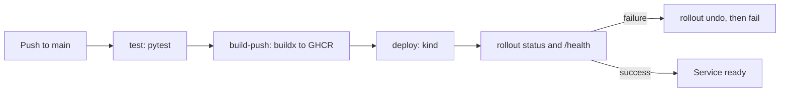

# Pipeline

Tool: GitHub Actions. One workflow, `.github/workflows/truthgraph-ci-cd.yml`. Triggers are push to `main`, pull request, and `workflow_dispatch`.

Source: `docs/diagrams/pipeline.mmd`.

## Jobs

1. **test.** `actions/setup-python@v7` uses Python 3.11. `pytest` runs in `service/`. The suite mocks Groq, Tavily, and Neo4j, so the job does not need API keys.
2. **build-push.** `docker/setup-buildx-action@v4`, `docker/login-action@v4`, `docker/build-push-action@v7`. The image is `ghcr.io/<owner>/truthgraph-api` with the commit SHA and `latest`. Pull requests build and do not push. The workflow permission is `packages: write` and the password is `GITHUB_TOKEN`.
3. **deploy.** Runs on push and `workflow_dispatch` only. `helm/kind-action@v1` creates a kind cluster with `kindest/node:v1.37.0`. The job pulls the SHA tag, retags it to `truthgraph-api:v1`, loads that image and `neo4j:5-community` into kind, applies the namespace, Neo4j, and the API Deployment, waits for `rollout status`, and execs `/health` and `/metrics`. If that step fails, the next step runs `kubectl rollout undo` on the API Deployment and exits 1.

Pull requests do not deploy, because the image is not pushed.

## Local versus CI

Local manifests use `imagePullPolicy: IfNotPresent` and images loaded with `kind load`. CI does the same after pulling from GHCR, so the manifest files do not contain a registry hostname. The registry name is only in the workflow.
